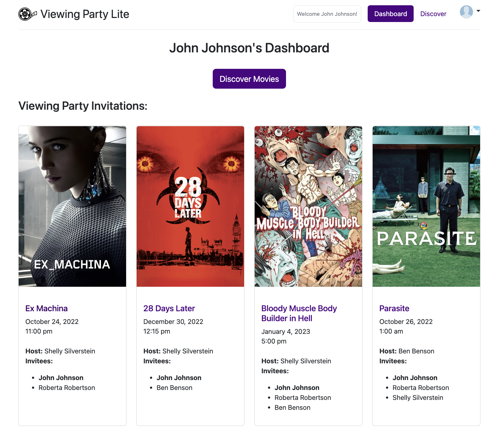
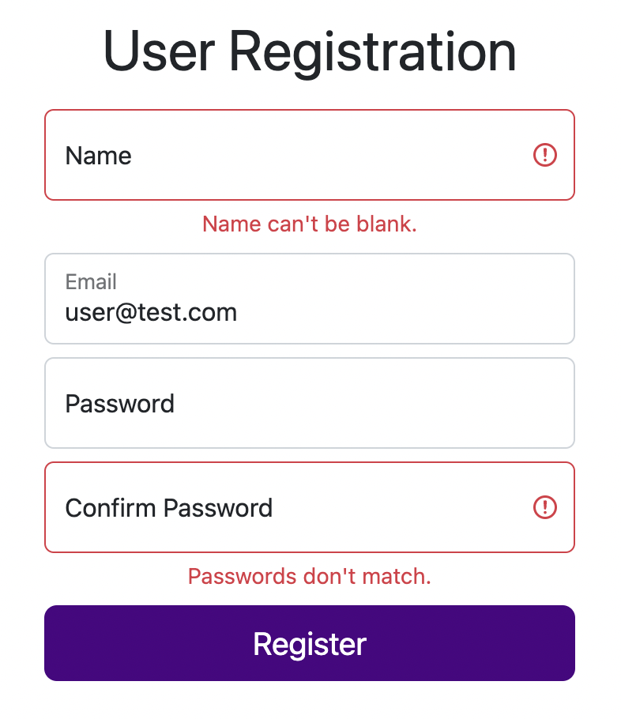
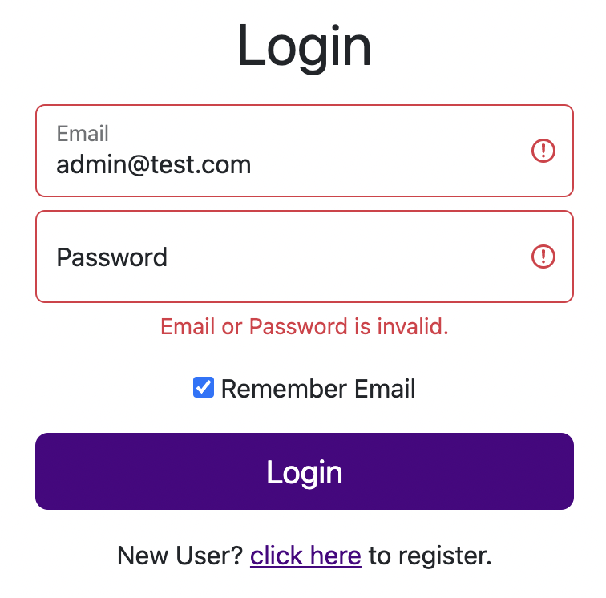
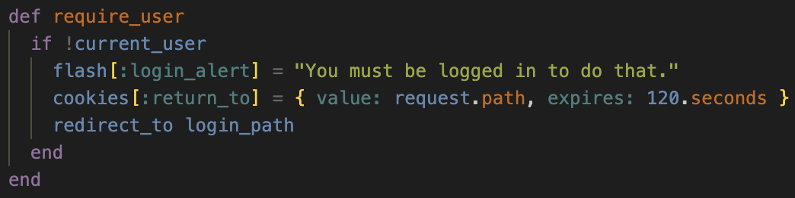
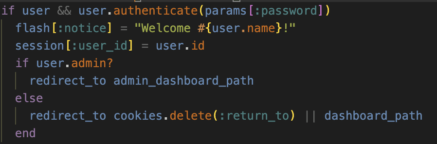
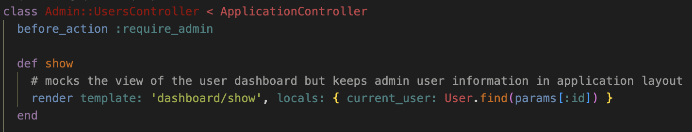
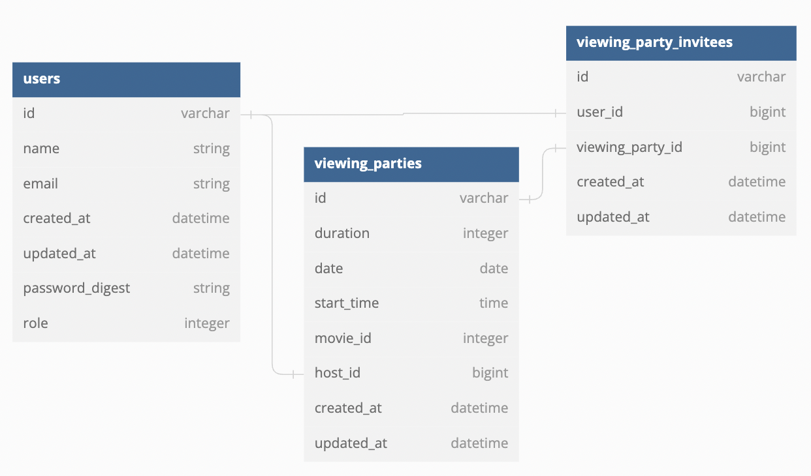

# Viewing Party Lite

[Visit the App Deployed on Heroku!](https://viewing-party-lite-totm.herokuapp.com/)

## About this Project

This is my implementation of the "Viewing Party" app at the Turing School of Software and Design. View the original project specification at: [Viewing Party Lite project](https://backend.turing.edu/module3/projects/viewing_party_lite). Originally a pair project, this repo is a solo fork that has a Bootsrap front-end and user authentication features added.

Viewing Part Lite is an application in which users can explore movie options and create a viewing party event for themselves and other users of the application.

## Learning Goals

- Consume an API with multiple endoints using principles of OOP.
- Test consumption of APIs using toold like Webmock and VCR.
- Learn and implement User Authentication, including for different user roles (admin access)
- Learn and implement Bootstrap for a professional front-end appearance.
- Use client cookies to implement a more user-friendly experience.

## Setup on Local Machine

1. Clone the repository: `git clone git@github.com:musselmanth/viewing_party_lite.git`
2. Install dependencies: `bundle install`
3. Setup the PostgreSQL database: `rails db:{create,migrate}`
4. Optionally, a test admin account can be setup by running `rails db:seed`. The email and password for login are "admin@test.com" and "test123".
5. View the app in your browser by running `rails server` and visiting `http://localhost:3000`

## Notable Features / Accomplishments

- Fully functional Bootstrap front-end with responsive forms that diplay server-side validation errors.

- User is redirected to login page when they reach a page that require authentication. A cookie is used to then redirect them back to the page they were on once they either login or register:

- Admin can view all users dashboards as if they were logged in as them:

- API consumption is done in an organized and scalable way using servies, facades, and POROs.

## Future Goals

- Add remaining CRUD functionality for Viewing Parties, like adding and removing invitees once they are created
- Implement caching and other refactoring to reduce load times by minimizing external API calls.
- Experiment more with Bootstrap to make site more mobile-friendly.
- Add email features, like being able to email reminders, or using email to reset password.
- Add user profile for updating user information/password
- Additional features for admins such as deleting or modifying existing viewing parties
- Use a gem like `redcarpet` to display Markdown properly in Movie Reviews

## Database Diagram

## Tech Used

- Ruby 2.7.4
- Rails 5.2.6
- Bootstrap 5.2
- PostgreSQL
- Deployed via Heroku

## Collaborators

[Taryn Orlemann!](https://github.com/torlemann)

Her version of the origin paired project can be found [here.](https://github.com/torlemann/viewing_party_lite)

## Project Wireframs

Example wireframes to follow are found [here](https://backend.turing.edu/module3/projects/viewing_party_lite/wireframes)
